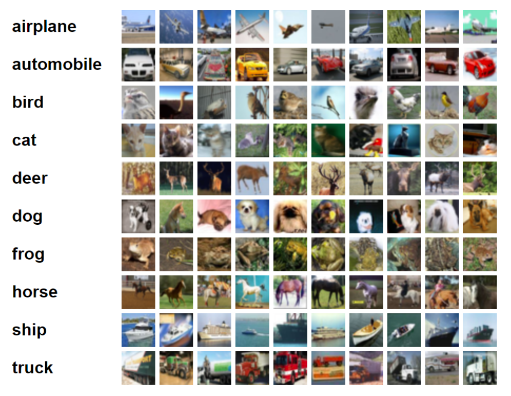

# ResNet-ResNeXt-DenseNet
TensorFlow Implementation of the ResNet, ResNeXt, DenseNet


# Introduction

Here we implement multiple neural network architectures and comparing them on various criterion like number of parameters, train and test set accuracies and provide detailed analysis of why one architecture works better than another one.


# Dataset

CIFAR-10 is a dataset consisting of 60000, 32×32 colour images in 10 classes, with 6000 images per class. There are 50000 training images and 10000 test images. More details about the datset can be found [here](http://www.cs.toronto.edu/~kriz/cifar.html).

Sample images from each class of the CIFAR-10 dataset is shown below:



A randomized version of the CIFAR-10 dataset with 50000 training images and 10000 test images can be downloaded from [here](https://drive.google.com/file/d/18jeQgtFuEmdH93S6bWzZxYeAOv-WHJoL/view?usp=sharing). CIFAR10 has two subfolders Train and Test for training and testing images respectively stored in .png format for ease of viewing and loading. Please replace these subfolders in the CIFAR10 folder and put it in the project directory.


# ResNet, ResNeXt, DenseNet

I have implemented a simple version of ResNet, ResNeXt, DenseNet network architectures. You can find all networks in the [Code/Network/Network.py](https://github.com/hsouri/ResNet-ResNeXt-DenseNet/blob/master/Code/Network/Network.py).


# Train and Test

Here we train a convolutional neural network on TensorFlow for the task of classification. The input is a single CIFAR-10 image and the output is the probabilities of 10 classes. The code given to you has Train.py file for training and Test.py for testing.


If you are super new to machine learning and deep learning, there are a lot of resources online to learn how to program a simple neural network, tune hyperparameters for CIFAR-10. A good starting point is the [official Tensorflow tutorial](https://www.tensorflow.org/tutorials/images/deep_cnn) and [this great tutorial by Hvass Labs](https://github.com/Hvass-Labs/TensorFlow-Tutorials). If you are new to deep learning, I recommend reading up basics from [CS231n course offered by Stanford University here](https://cs231n.github.io/).


The code given here has Tensorboard code snippets built-in and displays training accuracy per batch and the loss value. You can run TensorBoard using the following:

```shell
tensorboard --logdir=path/to/log-directory
```


# Model training

**Installation**

To train a new model first choose a network among all networks that are implemented in Network.py. You have 5 options: 
SimpleModel, ImprovedModel, ResNetModel, DenseNetModel, and ResNextModel. Then change line 134 of Train.py:


```shell
prLogits, prSoftMax = YourModel(ImgPH, ImageSize, MiniBatchSize)
```
Change "YourModel" with one of the above models.

- To start Training:

```shell
python Train.py --ExpName YourExpName
```

Note: Change YourExpName with any name you want!

- Model Testing

You can test your model on 1000 images:

```shell
python Test.py
``` 
